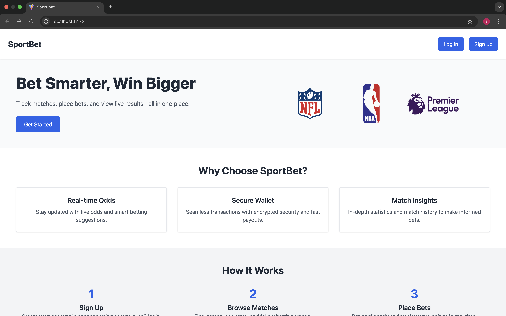
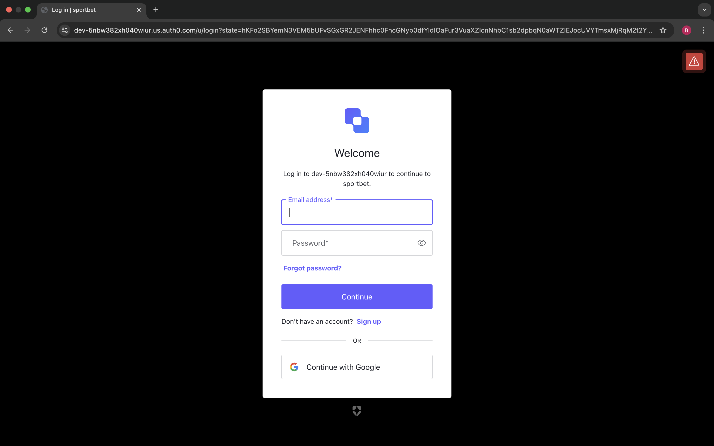
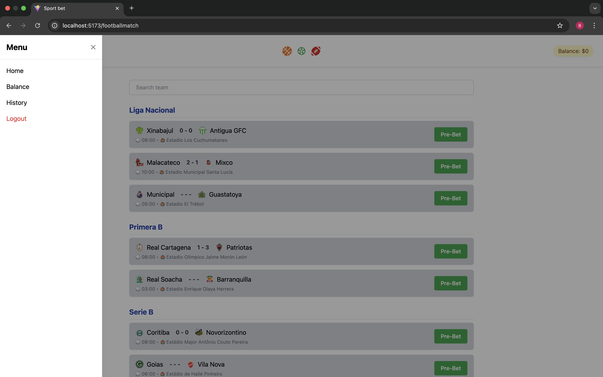
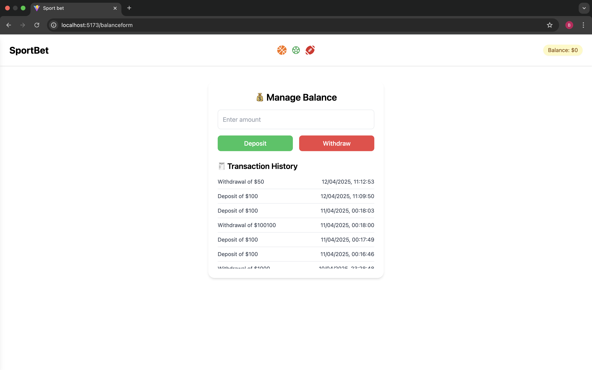
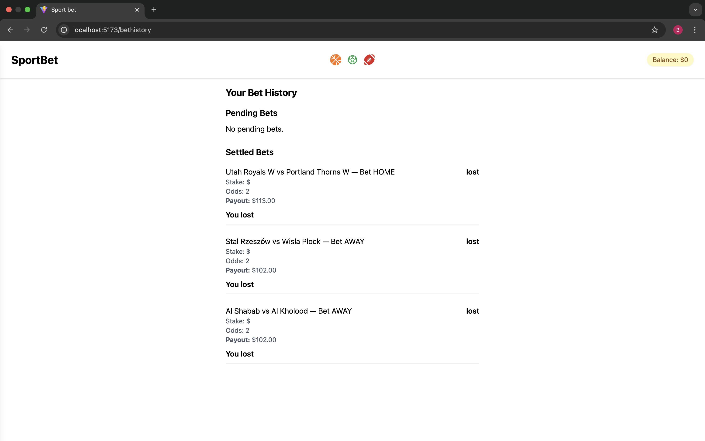

# 🏆 Sport Betting App

A web-based sports betting platform that allows users to:

- 🔍 Browse football, basketball, and NFL matches
- 📊 View detailed match stats and live odds
- 💸 Place bets using their account balance
- 🧾 Track bet history and account transactions
- 🔐 Log in securely using Auth0 authentication

---

## 🛠️ Built With

- **React** + **TypeScript**
- **Tailwind CSS** for styling
- **Vite** as the frontend build tool
- **Auth0** for authentication and user management

---

## 🔎 Preview

### 🏠 Landing Page

### 🔐 Login Page

### 🏀 Matches Page

### 🧭 Navbar

### 💳 Deposit / Withdrawal

### 📜 Bet History Page

---

## 🔗 API Requirements

- [Auth0](https://auth0.com/) – for secure authentication and user profile management
